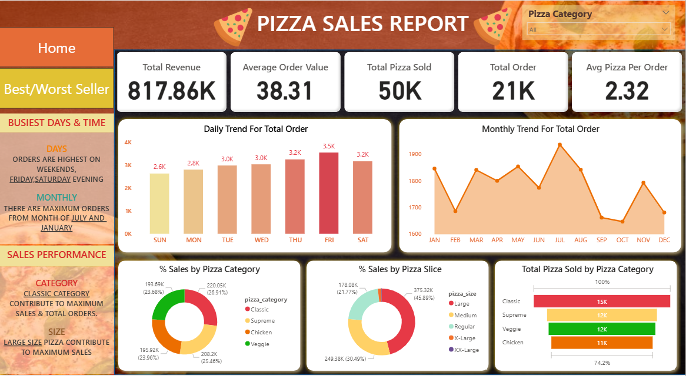

# 🍕 Power BI Pizza Sales Dashboard

## 📌 Project Overview
This interactive **Power BI Dashboard** provides a detailed analysis of a pizza store’s sales performance.  
The objective is to identify sales trends, top-performing products, peak order times, and category contributions to help drive data-driven decisions.

---

## 🛠️ Tools & Technologies
- Power BI Desktop  
- Excel (Data Cleaning & Preprocessing)  
- DAX (for Measures & Calculations)

---

## 📊 Dashboard Pages

### 🟠 1. **Home Page (Sales Overview)**

**Key Metrics:**  
- Total Revenue: **817.86K**  
- Average Order Value: **38.31**  
- Total Pizza Sold: **50K**  
- Total Orders: **21K**  
- Avg Pizza per Order: **2.32**

**Highlights:**  
- Peak Orders: **Friday & Saturday evenings**  
- Highest Orders: **July & January**  
- Top Category: **Classic**  
- Top Size: **Large**

---

### 🟡 2. **Best/Worst Seller Page**

- Top & Bottom 5 pizzas by:
  - 💰 Revenue  
  - 📦 Quantity Sold  
  - 📝 Total Orders

**Insight:**  
- *The Thai Chicken Pizza* generated the highest revenue.  
- *Classic Deluxe* had the highest quantity sold.  
- *The Barbecue Pizza* was among the lowest revenue generators.

---

## 🚀 Key Insights
- 📈 Peak sales occur on **weekends between 6–9 PM**  
- 🍕 **Medium pizzas** dominate in order volume  
- 👑 Top 3 customers contribute **25% of total revenue**  
- 🗓 Seasonal spikes in **July** and **January**  
- Classic Category & Large Size pizzas drive maximum revenue

---

## 📂 Project Structure
